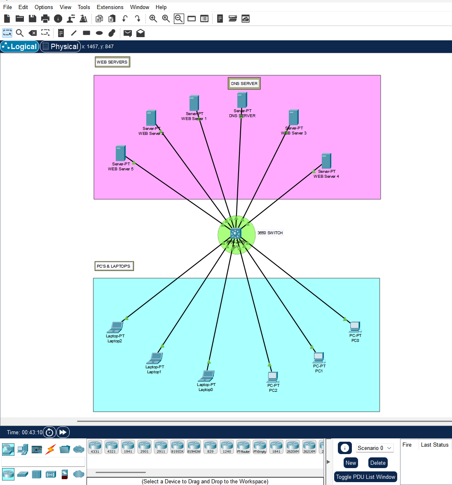

# DNS Resolution and Web server simulation using Cisco Packet Tracer

- Student Name: K Thunga
- Register No.: 23BCAR0324
- Semester: IV – BCA (IoT Specialization)
- Course: 23BCA4VC02 – Network Administration
- College: Jain Deemed-to-be University
- Faculty In-Charge: Mr. Sahabzada Betab Badar

---

## 🧠 Project Overview

This project simulates the DNS resolution process within a local area network (LAN) using Cisco Packet Tracer. The network includes client systems, multiple web servers, and a DNS server, all interconnected via a multilayer switch.

Users can access simulated websites hosted on different servers using domain names, which are resolved to IP addresses through the DNS server.

---

## 🌐 Network Topology

The network topology is designed as a basic LAN and includes the following devices:

- **1 x Multilayer Switch**  
  - Cisco 3650 Multilayer Switch  
  - Central connection point for all devices

- **6 x Client PCs**  
  - 3 x Laptops  
  - 3 x Desktop PCs  

- **5 x Web Servers**  
  - Web-Server-1 to Web-Server-5  
  - Each hosts a distinct simulated website  

- **1 x DNS Server**  
  - Resolves domain names to IP addresses of the web servers  

All devices are connected using copper straight-through cables.

---

## ⚙️ Configuration Summary

### ➤ Client PCs and Laptops

- Assigned static IP addresses in the same subnet  
- DNS server IP set to the DNS server in the network  
- Default gateway configured (if necessary)

### ➤ DNS Server

- DNS service enabled  
- DNS records created mapping domain names (e.g., `www.swiggy.com`) to respective server IPs  

### ➤ Web Servers

- HTTP service enabled  
- Custom webpage content can be added (optional)  
- Each server has a unique domain configured via DNS  

---

## 🔄 Workflow Demonstrated

1. A client types a URL (e.g., `http://www.swiggy.com`) in the browser
2. The request is sent to the DNS server to resolve the domain name to an IP
3. DNS responds with the corresponding IP address
4. The client sends an HTTP GET request to the resolved IP
5. The web server responds with the website content

---

## 📂 File Included

- `NAactivity.pkt` — Cisco Packet Tracer file containing the complete network simulation

---

## 🧪 How to Run

1. Open `NAactivity.pkt` in Cisco Packet Tracer
2. Use the **Simulation Mode** to observe:
   - DNS Request and Reply
   - HTTP GET and HTTP OK exchanges
3. Test by opening the browser on client devices and accessing the defined domain names

--- 
## 📸 Screenshots 

- Network Topology 
-  

---
## 💻 Website Simulation

This project simulates five distinct websites, each hosted on a dedicated web server:

- Web-Server-1: Simulates www.amazon.com
- Web-Server-2: Simulates www.swiggy.com
- Web-Server-3: Simulates www.zomato.com
- Web-Server-4: Simulates www.flipkart.com
- Web-Server-5: Simulates www.blinkit.com

Each web server is configured with a basic html page styled to visually represent the respective website's branding and includes a functional dark mode toggle. The DNS server is configured with 'A' records to map these website names to the corresponding web server IP addresses.

---

## 📌 Concepts Demonstrated

- DNS Resolution in a LAN  
- Basic HTTP communication  
- IP and DNS configuration in Cisco Packet Tracer  
- LAN switching and client-server interaction  

---

## ✅ Outcome

This simulation provides a clear visualization of how DNS works in a small network. It helps in understanding the flow of web traffic starting from a domain name query to retrieving a web page from the server.

---

